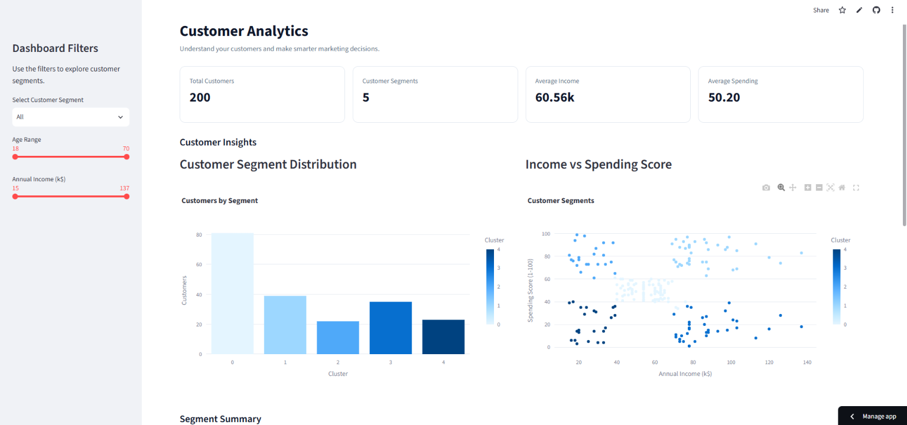
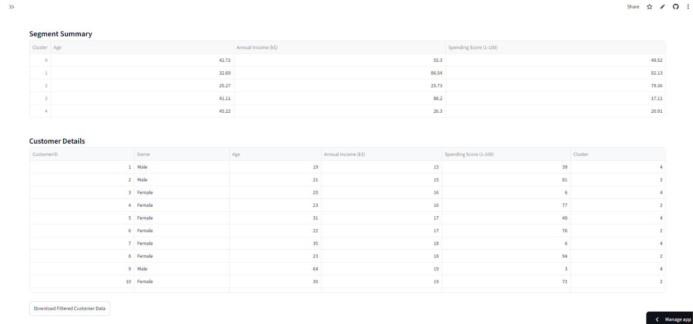

# Customer Segmentation Dashboard

An interactive data analytics dashboard that segments mall customers into distinct groups using K-Means clustering, built with Python and Streamlit.

**Live Demo:** [customer-segmentation-dashboard-zkpzygw6ahf9q9bn8hcefo.streamlit.app](https://customer-segmentation-dashboard-zkpzygw6ahf9q9bn8hcefo.streamlit.app/)

## Overview

This project analyzes mall customer data to identify meaningful customer segments based on annual income and spending behavior. It uses unsupervised machine learning (K-Means clustering) to group customers, then presents the insights through an interactive Streamlit dashboard.

## Screenshots





## Features

- Data cleaning and exploratory data analysis (EDA)
- Customer segmentation using K-Means clustering
- Elbow method for optimal cluster selection
- Interactive dashboard with:
  - Key customer metrics (total customers, segments, average income, average spending)
  - Filterable views by segment, age range, and income range
  - Segment distribution chart
  - Income vs. Spending Score scatter plot
  - Per-segment summary statistics
  - Filterable, downloadable customer data table

## Tech Stack

- **Python** – core language
- **Pandas / NumPy** – data processing
- **Scikit-learn** – K-Means clustering
- **Plotly** – interactive visualizations
- **Streamlit** – dashboard framework

## Dataset

Mall Customer Segmentation dataset — includes Customer ID, Gender, Age, Annual Income, and Spending Score for 200 mall customers.

## How It Works

1. Load and clean the customer dataset
2. Scale features (Annual Income, Spending Score) using StandardScaler
3. Determine optimal cluster count using the Elbow Method
4. Apply K-Means clustering (k=5) to segment customers
5. Visualize and summarize each segment in an interactive dashboard

## Run Locally

```bash
git clone https://github.com/kawshaninperera1112-source/customer-segmentation-dashboard.git
cd customer-segmentation-dashboard
pip install -r requirements.txt
streamlit run app.py
```

## Author

**Kawshani Perera**
BICT (Hons) Undergraduate
